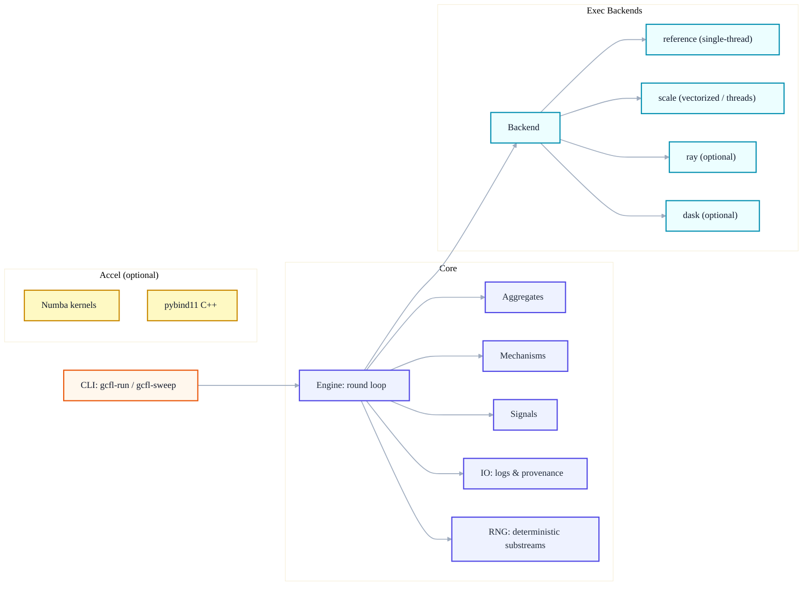

<p align="center">
  <!-- Optional badges (delete or add more as you like) -->
  <a href="https://arxiv.org/abs/XXXX.XXXXX">
    
  </a>
  <a href="https://github.com/AndrewKim1997/gcfl-sim/actions/workflows/ci.yml">
    
  </a>
  
  <a href="LICENSE">
    
  </a>
</p>

<h1 align="center">GCFL-Simulator — A Toolkit for Gaming &amp; Cooperation in Federated Learning</h1>

<p align="center">
  <strong>Related resources:</strong>
  <a href="https://github.com/AndrewKim1997/gcfl">Reproducibility repository (gcfl)</a>
  &nbsp;·&nbsp;
  <a href="https://arxiv.org/abs/XXXX.XXXXX">arXiv preprint</a>
</p>

# GCFL-SimulatorA Toolkit for Gaming & Cooperation in Federated Learning

> An **open-source simulator** inspired by the paper *“Gaming and Cooperation in Federated Learning: What Can Happen and How to Monitor It”* — built as an **independent** project so researchers and engineers can **experiment, extend, and scale** beyond the manuscript.

* **What this is:** a modular simulator with pluggable **signals**, **aggregators**, **mechanisms**, and **execution backends** (single-thread, vectorized, distributed).
* **What this is not:** the paper’s reproducibility repo. For one-click artifact regeneration (figures/tables) see the separate **`gcfl`** reproducibility repository.

---

## ✨ Overview

GCFL-Sim provides a compact API and CLIs to study *monitoring signals* (e.g., `M`), *game-theoretic reactions* (e.g., `PoG`, `PoC`), and *utility shifts* (`ΔU`) under configurable client populations (N), rounds (T), and repeats (R).
It’s designed to be:

* **Composable:** swap aggregators/mechanisms via a small registry.
* **Deterministic:** reproducible RNG substreams at repeat/round/client granularity.
* **Scalable:** drop-in backends for vectorized or distributed execution.
* **Extensible:** write new plugins in a few lines (see `examples/plugins/`).

---

## 🖥️ Architecture & Tech Stack

**Languages & runtime**

* **Python** (core engine, backends, registry, CLI)
* **Optional acceleration:** **Numba** JIT (`accel/numba_kernels.py`) and **C++/pybind11** (`accel/cpp/`) for hot loops
* **Optional distributed:** **Ray** or **Dask** backends
* **Docker** images for CPU/CUDA environments

**Module diagram (high level)**



---

## 📦 Installation

### Option A — pip (editable)

Core only:

```bash
python -m venv .venv && source .venv/bin/activate
pip install -U pip
pip install -e .
```

Core + dev tools (ruff/pytest):

```bash
pip install -e .[dev]
```

Optional extras:

```bash
# Acceleration (Numba, pybind11 headers)
pip install -e .[fast]

# Distributed backends (Ray/Dask)
pip install -e .[dist]

# Everything for local development
pip install -e .[dev,fast,dist]
```

### Option B — Conda

```bash
conda env create -f environment.yml
conda activate gcfl-sim
pip install -e .[dev]
```

### (Optional) Build C++ extension

```bash
cd accel/cpp
cmake -S . -B build
cmake --build build --config Release
# A gcfl_fast.*.so will be produced; make sure it’s on PYTHONPATH
```

---

## 🐳 Docker

**CPU image**

```bash
docker build -f docker/Dockerfile -t gcfl-sim:cpu .
docker run --rm -v "$PWD:/workspace" gcfl-sim:cpu \
  python -m gcfl.run -c configs/base.yaml -o results/logs/run.parquet
```

**CUDA image (optional)**

```bash
docker build -f docker/Dockerfile.cuda -t gcfl-sim:cuda .
docker run --gpus all --rm -v "$PWD:/workspace" gcfl-sim:cuda \
  python -m gcfl.run -c configs/base.yaml --backend ray -o results/logs/ray_run.parquet
```

**Ray mini-cluster (optional)**

```bash
docker compose -f docker/docker-compose.yml up -d --scale ray-worker=2
docker compose -f docker/docker-compose.yml run --rm runner
```

---

## 🏃 Quick start

Single run:

```bash
python -m gcfl.run \
  -c configs/base.yaml \
  -o results/logs/run.parquet
```

Alpha–Pi sweep (9 points):

```bash
python -m gcfl.sweep \
  -c configs/base.yaml \
  --grid "mechanism.alpha=0.0,1.0,2.0" \
  --grid "mechanism.pi=0.0,0.5,1.0" \
  -o results/logs/alpha_pi.parquet
```

All-in demo (script):

```bash
bash scripts/quickstart.sh
# outputs → results/logs/*.parquet and results/figures/*.png
```

---

## ⚙️ Configuration & CLI options

Config files live under `configs/`. Minimal example (`configs/base.yaml`):

```yaml
meta:
  experiment: gcfl_sim_reference
  seed_root: 20250901

execution:
  backend: reference          # reference | scale | ray | dask
  parallel_workers: 0
  log_every: 1

engine:
  clients: 200                # N
  rounds: 60                  # T
  repeats: 5                  # R

signals:
  model: affine               # see gcfl.signals
  a: 1.0
  b: 0.0
  noise_sigma: 0.5
  clip: null

aggregator:
  kind: mean                  # mean | median | trimmed | sorted_weighted
  trim_ratio: 0.10            # used by 'trimmed'

mechanism:
  policy: u_orth_penalty      # see gcfl.mechanisms
  alpha: 1.2
  pi: 0.20
  phi: 1.0
  eta: 1.0
  benign_threshold: 0.10
  neutralize_when_deltaU_ge_0: true

logging:
  out_format: parquet         # parquet | csv
  float_precision: 6
```

Common CLI overrides (apply to both `gcfl-run` and `gcfl-sweep`):

```
--backend reference|scale|ray|dask
--workers <int>
--clients <N> --rounds <T> --repeats <R>
--signal-model affine --a <float> --b <float> --noise-sigma <float>
--aggregator mean|median|trimmed|sorted_weighted [--trim-ratio <float>]
--policy u_orth_penalty --alpha <float> --pi <float> --phi <float> [--eta <float>]
--out-format parquet|csv
```

Sweeps:

* Use YAMLs under `configs/sweeps/` **or** provide `--grid "path.to.param=…"` on the CLI.
* Outputs one table with per-experiment annotations (e.g., `mechanism.alpha`, `mechanism.pi`).

---

## 🧪 Demos & Example Outputs

Generate figures from any produced logs:

```bash
python scripts/make_figs.py \
  --glob "results/logs/*.parquet" \
  --outdir results/figures
```

What you’ll see:

* **Time-series**: `M` over rounds (mean ± std across repeats).
* **α–π heatmaps**: aggregated `M` across sweeps.
* **Boundary/frontier**: sign map of `ΔU` and extracted φ\*(α).

Data columns (typical):

```
repeat, round, N, aggregator, mechanism, alpha, pi, M, PoG, PoC, DeltaU
```

For a minimal Python example, run:

```bash
python examples/python_api.py
```

For extending the simulator with your own aggregator, see:

```
examples/plugins/README.md
```

---

## 🔌 Plugins (Aggregates / Signals / Mechanisms)

Register new components via decorators in `gcfl.registry`:

```python
from gcfl.registry import register_aggregator

@register_aggregator("topk_mean")
def aggregate(values, *, k_frac: float = 0.2, **_):
    ...
```

Then pick it in configs:

```yaml
aggregator:
  kind: topk_mean
  k_frac: 0.25
```

---

## 📊 Benchmarks & Profiling

Micro-benchmarks:

```bash
python scripts/benchmark.py --backends reference scale --clients 200 1000 --rounds 60 --repeats 5
```

Profiling helpers:

```bash
bash scripts/profile.sh               # cProfile, py-spy (if installed)
```

---

## 🤝 Contributing

We welcome bug reports, use-cases, and PRs!

* Run checks locally:

  ```bash
  ruff format src tests
  ruff check src tests --fix
  pytest -q
  ```
* Keep changes **deterministic** (RNG substreams) and **documented** (configs, seeds).
* Add unit tests for new plugins/backends.
* For feature proposals, please open a discussion/issue first.

---

## 📚 Related

* **Reproducibility repo (paper artifacts):** `gcfl` — contains one-click scripts to regenerate all figures/tables from canonical logs.
* **This repo (gcfl-sim):** a general-purpose simulator for exploring new ideas at small or large scale.

---

## 📝 License

Code is released under the **MIT License**.
Datasets and external dependencies remain under their respective licenses.
